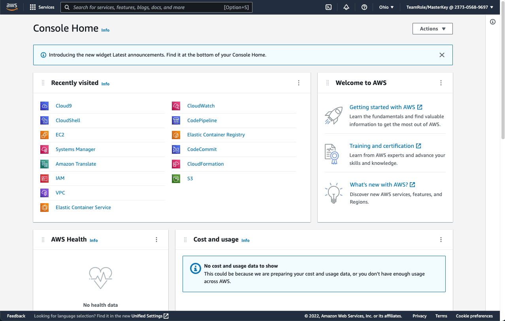
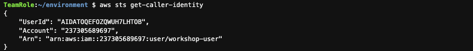

# EKS Security Workshop

[**< Voltar**](./README.md)

## 1 - Preparar o Ambiente de Trabalho

Mesmo com a maior parte do ambiente já preparado, precisamos realizar pequenas modificações que não foram possíveis de automatizar:

1. Seguindo os passos descritos inicialmente aqui no repositório, vamos acessar a console do serviço AWS Cloud9 e abrir o nosso ambiente chamado `ekssecurityworkshop`:



2. Vamos garantir que não estamos usando credenciais temporárias do AWS Cloud9 para a execução das atividades pois elas são incompatíveis com alguns comandos do AWS Copilot, dado que a ferramenta foi pensada no fluxo de trabalho de uma pessoa desenvolvedora:


3. Dentro do ambiente AWS Cloud9, usando o terminal embarcado, vamos configurar o AWS CLI v2 usando o IAM User `workshop-user` e a credencial de acesso criados para o workshop (salvos como saídas no AWS CloudFormation). E para isso, vamos usar do AWS CLI para obter esses dados, popular variáveis de ambiente, e gerar o arquivo de configuração final:

```bash
export WORKSHOP_CFN_STACK_NAME=$(aws cloudformation list-stacks --query 'StackSummaries[?StackStatus == `CREATE_COMPLETE` && contains(@.StackName, `mod`)].StackName' --output text)
export WORKSHOP_USER_KEYID=$(aws cloudformation describe-stacks --stack-name $WORKSHOP_CFN_STACK_NAME --query 'Stacks[].Outputs[? OutputKey == `WorkshopUserKeyId`].OutputValue' --output text)
export WORKSHOP_USER_SECRET=$(aws cloudformation describe-stacks --stack-name $WORKSHOP_CFN_STACK_NAME --query 'Stacks[].Outputs[? OutputKey == `WorkshopUserKeySecret`].OutputValue' --output text)

cat <<EOF > ~/.aws/config
[default]
region=$(curl -s http://169.254.169.254/latest/dynamic/instance-identity/document | jq .region -r)
output=json
EOF

cat <<EOF > ~/.aws/credentials
[default]
aws_access_key_id = $WORKSHOP_USER_KEYID
aws_secret_access_key = $WORKSHOP_USER_SECRET
EOF
```

4. Depois precisamos validar que de fato vamos estar usando o IAM User `workshop-user` com o seguinte comando:

```bash
aws sts get-caller-identity
```



Isso é tudo! Vamos começar a criar nosso ambiente do Amazon ECS com a CLI do AWS Copilot.

[**Próximo >**](./2-Infra.md)
