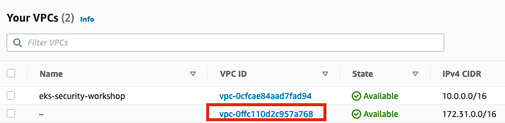

# EKS Security Workshop

[**< Voltar**](./10-Lab8.md)

# Incident response and forensics

## Scan de vulnerabilidade no Kubernetes com kube-hunter
​
O [kube-hunter](https://github.com/aquasecurity/kube-hunter) procura por pontos fracos de segurança nos clusters do Kubernetes. A ferramenta pela Acqua Security para "caçar" vulnerabilidades em clusters Kubernetes.
​
O Kube-Hunter é muito fácil versátil e pode ser executado localmente, para fazer a verificação de vulnerabilidade remotamente no cluster ou pode ser executado em um dos hosts como um Pod que irá executar e disponibilizar o relatório via logs. No nosso workshop, vamos explorar essas duas opções.
​
Primeiro, vamos instalar o kube-hunter localmente no nosso Cloud9 para executar as verificações de vulnerabilidade remotamente no Cluster do Amazon EKS.
​
Instale o kube-hunter através do Pip com o comando a seguir: 
​
```bash
pip install kube-hunter
```
​
Execute o kube-hunter:  
​
```bash
kube-hunter
```
​
Escolha a opção um para executarmos um scan remoto. 
​
<p align="left"> 

</p>
​
Abra um novo terminal e utilizando o comando abaixo, copie o endereço IP de um dos worker nodes do cluster: 

```bash
kubectl get no -o wide
```
​
<p align="left"> 

</p>
​
Cole o endereço IP e pressione Enter para executar o scan. 
​
No nosso caso não foram encontradas vulnerabilidades de segurança com o scan remoto. 
​
<p align="left"> 

</p>
​
Vamos agora implementar o kube-hunter no cluster do Amazon EKS, como um Pod, e verificar se existem problemas de segurança no nosso ambiente. 
​
Antes de iniciarmos, acesse a pasta do workshop de Kube-hunter no seu Cloud9  

```bash
cd ~/environment/eks-security-workshop/lab9
```
​
## Instalando o kube-hunter como um Pod no cluster do Amazon EKS
​
Instalaremos o kube-hunter como um Pod para executar scans no nosso cluster do Amazon EKS, no modo Pod. 
​
Essa opção permite descobrir o que a execução de um container malicioso pode fazer/descobrir em seu cluster. Isso dá uma perspectiva sobre o que um invasor poderia fazer se conseguisse comprometer um Pod. Você verá que esse modo irá reportar muito mais vulnerabilidades. 
​
O arquivo job.yaml de exemplo define um job que executará o kube-hunter em um Pod, usando as configurações padrão de acesso ao Pod do Kubernetes. (Você pode modificar esse parâmetro, por exemplo, para executar como um usuário não root ou para executar em um namespace diferente.) 

Obs: Para que possamos executar o job do kube-hunter precisamos adicionar um VPC Peering entre a VPC que está nosso ambiente Cloud9 (VPC default) e a VPC do nosso Cluster EKS. Para isso vamos editar o Terraform de criação da nossa infra. 

Primeiro precisamos identificar qual nossa VPC Default Id: 

Na console acesse VPC e na sessão your VPCs copie o Id da VPC que está sem nome, na imagem abaixo é: vpc-0ffc110d2c957a768 

<p align="left"> 

</p>

No arquivo **eks-security-workshop/terraform/main.tf** vamos adicionar o seguinte trecho de código na sessão Supporting Resources abaixo do module "vpc" : 

```
module "vpc_peering" {
  source = "cloudposse/vpc-peering/aws"
  requestor_vpc_id = "vpc-0ffc110d2c957a768"
  acceptor_vpc_id  = module.vpc.vpc_id
  auto_accept   = true
}
```
Após executar essa modificação, executar o Terraform init (para poder instalar o modulo) e plan em seguida
OBS: verifiquem se estão no path correto): 

```
cd ~/environment/eks-security-workshop/terraform/
terraform init
terraform plan
```

Por fim, realizar o Terraform apply para criar os recursos: 

```
terraform apply --auto-approve
```

Com a VPC Peering será possível rodar o remote scan. Para isso execute o comando abaixo para instalar instanciar o Pod e executar o job do kube-hunter com o arquivo exemplo:

```bash
cd ~/environment/eks-security-workshop/lab9
kubectl create -f ./job.yaml
```
​
Verifique se o Pod do kube-hunter executou e copie o nome do Pod: 
​
```bash
kubectl get pod
```

<p align="left"> 

</p>
​
Execute o comando abaixo para ver os resultados do scan: 
​
```bash
kubectl logs [nome do Pod]
```
​
<p align="left"> 

</p> 
​
Veja que nesse modo foi gerado um relatório mais detalhado de vulnerabilidades encontradas nesse worker node específico. 


[**Próximo >**](./12-Lab10.md)