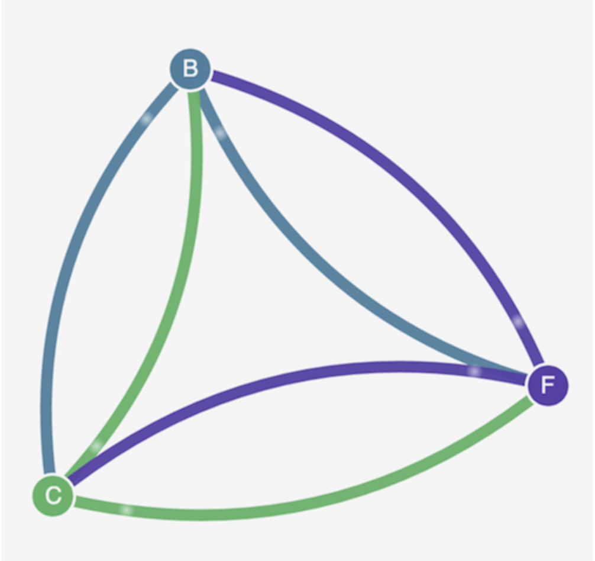
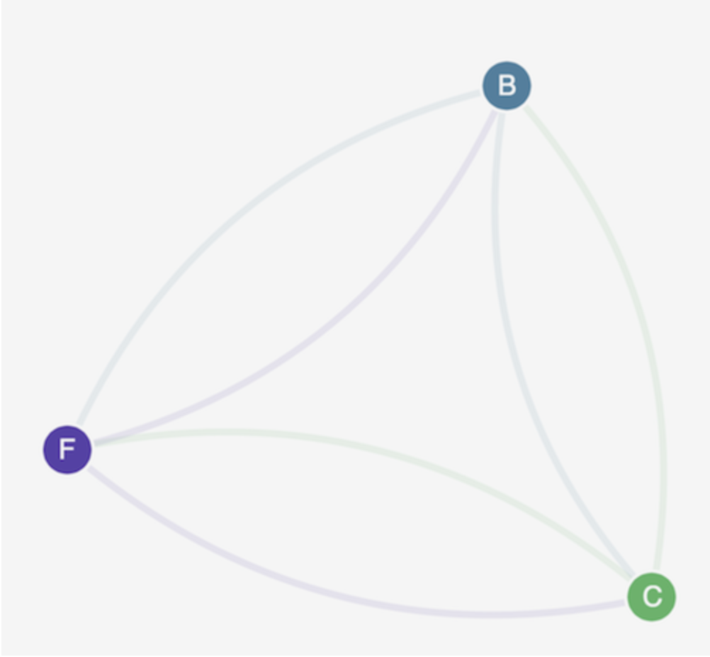
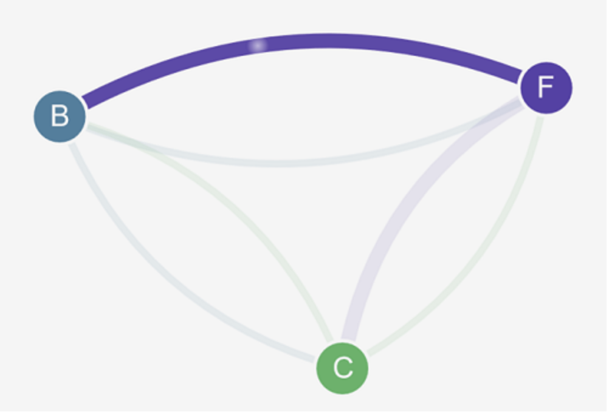
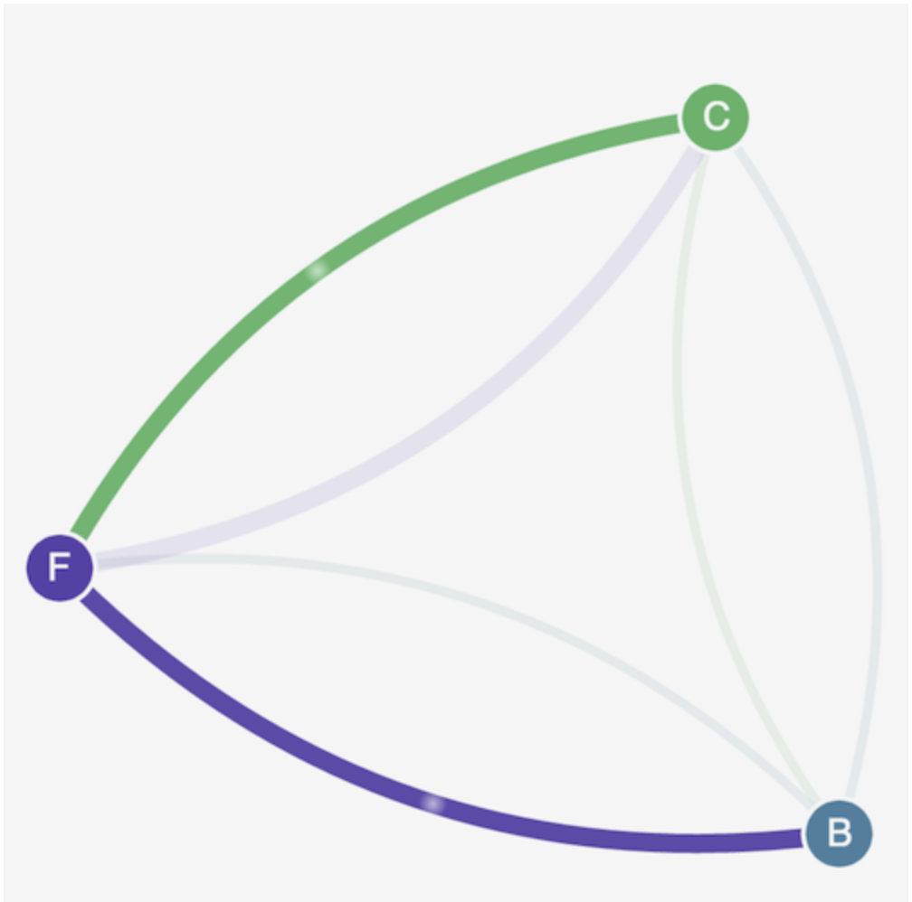

# EKS Security Workshop

[**< Voltar**](./5-Lab3.md)

# Network security

## Implementação de network security policies (políticas de segurança de rede) com Calico

### Objetivo

Neste laboratório, veremos a demonstração da política starts (de estrelas) fornecida pelo projeto Calico. A demonstração cria um serviço de front-end, back-end e cliente em seu cluster do Amazon EKS. A demonstração também cria uma interface gráfica do usuário de gerenciamento que mostra os caminhos de entrada e saída disponíveis entre cada serviço. Recomendamos que você conclua a demonstração em um cluster no qual você não executa cargas de trabalho de produção. É uma reprodução do seguinte [tutorial](https://projectcalico.docs.tigera.io/security/tutorials/kubernetes-policy-demo/kubernetes-demo). 

### Instalando o Calico 

a. Aplique os manifestos Calico ao seu cluster. Esses manifestos criam um DaemonSet no namespace calico-system.

```
kubectl apply -f https://raw.githubusercontent.com/aws/amazon-vpc-cni-k8s/master/config/master/calico-operator.yaml
kubectl apply -f https://raw.githubusercontent.com/aws/amazon-vpc-cni-k8s/master/config/master/calico-crs.yaml
```

```
kubectl get daemonset calico-node --namespace calico-system
``` 

Resultado: Os valores nas colunas DESIRED e READY devem corresponder e a saída deve ser semelhante a seguinte:

```
NAME          DESIRED   CURRENT   READY   UP-TO-DATE   AVAILABLE   NODE SELECTOR            AGE
calico-node   1         1         1       1            1           kubernetes.io/os=linux   26m
```

```
kubectl get daemonset calico-node --namespace calico-system
``` 
Antes de criar qualquer política de rede, todos os serviços podem se comunicar bidirecionalmente. Depois de aplicar as políticas de rede, você pode ver que o cliente só pode se comunicar com o serviço de front-end e o back-end só aceita tráfego do front-end.

1. Aplique os serviços de front-end, back-end e interface do cliente:

```
kubectl create -f https://projectcalico.docs.tigera.io/security/tutorials/kubernetes-policy-demo/manifests/00-namespace.yaml
kubectl create -f https://projectcalico.docs.tigera.io/security/tutorials/kubernetes-policy-demo/manifests/01-management-ui.yaml
kubectl create -f https://projectcalico.docs.tigera.io/security/tutorials/kubernetes-policy-demo/manifests/02-backend.yaml
kubectl create -f https://projectcalico.docs.tigera.io/security/tutorials/kubernetes-policy-demo/manifests/03-frontend.yaml
kubectl create -f https://projectcalico.docs.tigera.io/security/tutorials/kubernetes-policy-demo/manifests/04-client.yaml
```

2. Aplicar serviços de interface com o usuário de gerenciamento (ui management).

```
cat << EoF > 01-management-ui.yaml
apiVersion: v1
kind: Namespace
metadata:
  name: management-ui
  labels:
    role: management-ui
---
apiVersion: v1
kind: Service
metadata:
  name: management-ui
  namespace: management-ui
spec:
  type: LoadBalancer
  ports:
    - port: 9001
      targetPort: 9001
      nodePort: 30002
      protocol: TCP
  selector:
    role: management-ui
---
apiVersion: v1
kind: ReplicationController
metadata:
  name: management-ui
  namespace: management-ui
spec:
  replicas: 1
  template:
    metadata:
      labels:
        role: management-ui
    spec:
      containers:
        - name: management-ui
          image: calico/star-collect:v0.1.0
          imagePullPolicy: Always
          ports:
            - containerPort: 9001
EoF

kubectl apply -f 01-management-ui.yaml
```

3. Aguarde até que todos os pods entrem no estado Em execução. Para verificar, execute o seguinte comando:

```
kubectl get pods --all-namespaces --watch
```

OBS: Observe que pode levar vários minutos para baixar as imagens do Docker necessárias para esta demonstração.

4. Para se conectar à interface do usuário de gerenciamento, obtenha o URL do loadbalancer (balanceador de carga).

```
kubectl get svc management-ui -n management-ui -o jsonpath="{.status.loadBalancer.ingress[*].hostname}" 
``` 

5. Abra um navegador em seu sistema local e aponte-o para http://<loadbalancer-step-anterior>:9001/. Você deve ver na managemnet-ui (interface do usuário de gerenciamento). O nó C é o serviço do cliente, o nó F é o serviço de front-end e o nó B é o serviço de back-end. Cada nó tem acesso total à comunicação com todos os outros nós, conforme indicado pelas linhas coloridas em negrito.

<p align="center"> 

</p>

6. Aplique as seguintes network policies (políticas de rede) para isolar os serviços uns dos outros:

```
kubectl create -n stars -f https://projectcalico.docs.tigera.io/security/tutorials/kubernetes-policy-demo/policies/default-deny.yaml
kubectl create -n client -f https://projectcalico.docs.tigera.io/security/tutorials/kubernetes-policy-demo/policies/default-deny.yaml
``` 
7. Atualize seu navegador. Você vê que a interface do usuário de gerenciamento não pode mais alcançar nenhum dos nós, portanto, eles não aparecem na interface do usuário.

8. Aplique as seguintes netowork policies (políticas de rede) para permitir que a interface do usuário de gerenciamento acesse os serviços:

```
kubectl create -f https://projectcalico.docs.tigera.io/security/tutorials/kubernetes-policy-demo/policies/allow-ui.yaml
kubectl create -f https://projectcalico.docs.tigera.io/security/tutorials/kubernetes-policy-demo/policies/allow-ui-client.yaml
```

9. Atualize seu navegador. Você vê que a interface com o usuário de gerenciamento pode alcançar os nós novamente, mas os nós não podem se comunicar entre si.

<p align="center"> 

</p>

10. Aplique a seguinte network policy (política de rede) para permitir o tráfego do serviço de front-end para o serviço de back-end:

```
kubectl create -f https://projectcalico.docs.tigera.io/security/tutorials/kubernetes-policy-demo/policies/backend-policy.yaml
```

11. Atualize seu navegador. Você vê que o front-end pode se comunicar com o back-end.

<p align="center"> 

</p>

12. Aplique a seguinte network policy política de rede para permitir o tráfego do cliente para o serviço front-end.

``` 
kubectl create -f https://projectcalico.docs.tigera.io/security/tutorials/kubernetes-policy-demo/policies/frontend-policy.yaml
``` 

13. Atualize seu navegador. Você vê que o cliente pode se comunicar com o serviço front-end. O serviço de front-end ainda pode se comunicar com o serviço de back-end.

<p align="center"> 

</p>

14. Clean Up: Quando finalizar o lab, exclua seus recursos:

```
kubectl delete -f https://projectcalico.docs.tigera.io/security/tutorials/kubernetes-policy-demo/manifests/04-client.yaml
kubectl delete -f https://projectcalico.docs.tigera.io/security/tutorials/kubernetes-policy-demo/manifests/03-frontend.yaml
kubectl delete -f https://projectcalico.docs.tigera.io/security/tutorials/kubernetes-policy-demo/manifests.yaml
kubectl delete -f https://projectcalico.docs.tigera.io/security/tutorials/kubernetes-policy-demo/manifests/00-namespace.yaml
kubectl delete -f 01-management-ui.yaml
kubectl delete -f https://raw.githubusercontent.com/aws/amazon-vpc-cni-k8s/master/config/master/calico-crs.yaml
kubectl delete -f https://raw.githubusercontent.com/aws/amazon-vpc-cni-k8s/master/config/master/calico-operator.yaml
``` 


[**Próximo >**](./7-Lab5.md)