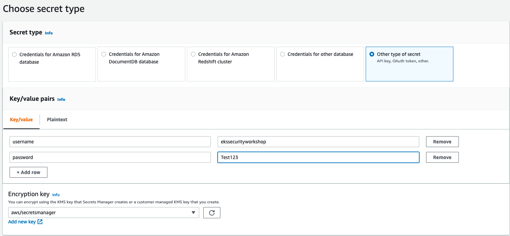
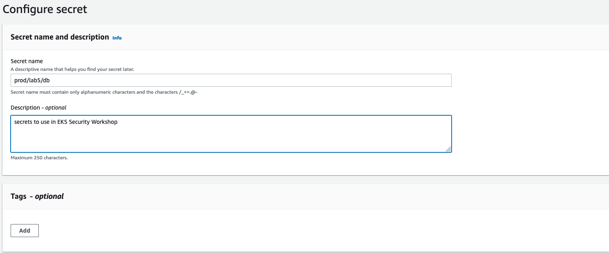
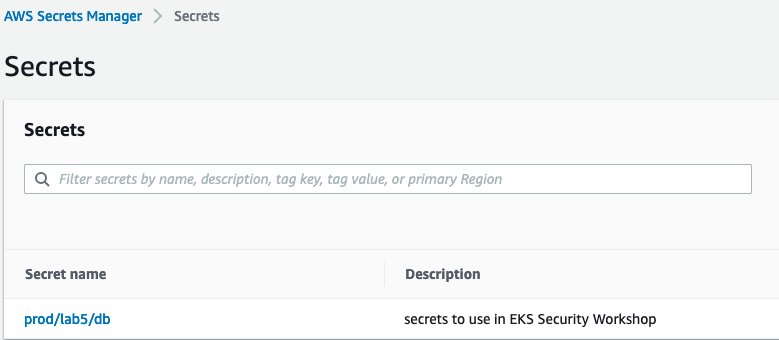
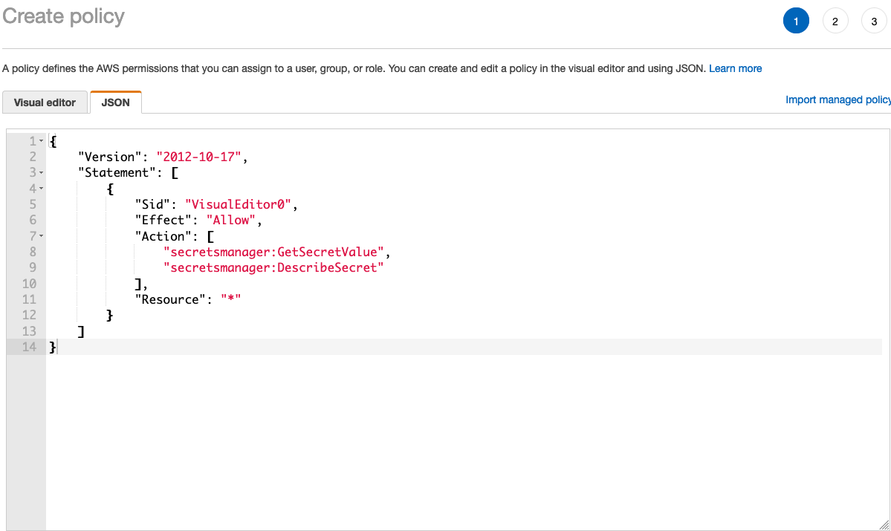
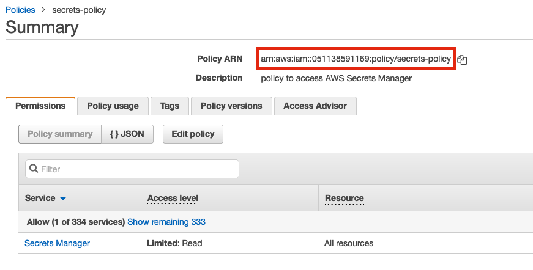
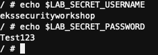
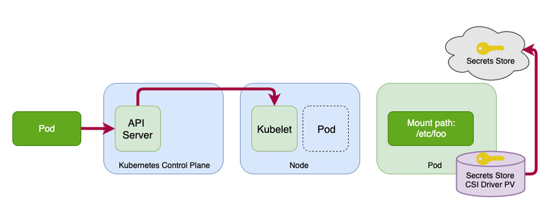
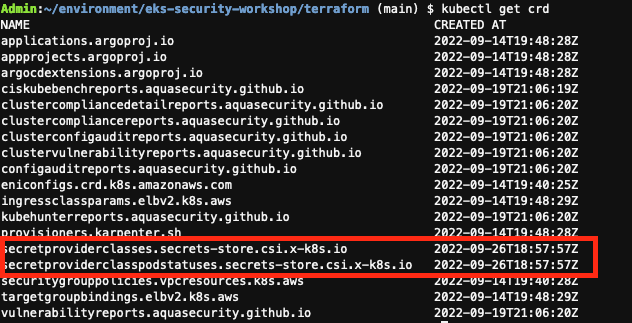

# EKS Security Workshop

[**< Voltar**](./6-Lab4.md)

# Data encryption and secrets management

O Secret management (gerenciamento de segredos) é um aspecto desafiador, mas crítico, da execução de aplicativos em container seguros e dinâmicos em escala. Para dar suporte a essa necessidade de distribuir secrets(segredos ) com segurança para aplicativos em execução, o Kubernetes fornece funcionalidade nativa para gerenciar segredos na forma de Kubernetes secrets (segredos do Kubernetes). No entanto, muitos clientes optam por centralizar o gerenciamento de segredos fora de seus clusters Kubernetes usando armazenamentos de segredos externos, como o AWS Secrets Manager e Hashicorp Vault para melhorar a segurança, o gerenciamento e a capacidade de auditoria do uso de secrets (segredos).

O consumo de external secret stores (segredos de armazenamentos secretos externos) geralmente requer modificações no código do aplicativo para oferecer suporte a chamadas baseadas em API para o armazenamento externo para recuperar um segredo no tempo de execução do aplicativo. Ao executar aplicativos no Amazon EKS, você pode usar a flexibilidade do Kubernetes para expor secrets diretamente aos pods sem exigir alterações no código do aplicativo. Um exemplo de como fazer isso é usando o [AWS Secrets and Configuration Provider (ASCP) para o driver CSI do Kubernetes Secrets Store](https://secrets-store-csi-driver.sigs.k8s.io/). O ASCP usa o driver [CSI do Secrets Store para expor secrets do AWS Secrets Manager aos seus pods como um volume de armazenamento montado](https://aws.amazon.com/blogs/security/how-to-use-aws-secrets-configuration-provider-with-kubernetes-secrets-store-csi-driver/). Essa solução pode ser adotado hoje somente com o uso de EC2 como layer de computação.

Os clientes que usam o Amazon EKS para orquestrar seus aplicativos tem a possibilidade de utilizar o AWS Fargate como sua camada de computação (compute layer) para reduzir a complexidade de gerenciamento da operação de suas cargas de trabalho em contêiner (workloads em container). Para clientes que têm clusters EKS com nós do AWS Fargate, será necessário um método diferente de consumo de segredos externos (external secrets), pois o ASCP com o CSI do armazenamento de segredos é implantado em seu cluster EKS como um daemonset. E os daemonsets não são suportados no Fargate.

Uma opção para resolvermos isso é a utilização do Open Source [External Secrets Operator](https://github.com/external-secrets/external-secrets). O External Secrets gerencia seus segredos de maneira diferente do driver CSI do Armazenamento de Segredos. Em vez de montar segredos como volumes, os Segredos Externos lêem segredos de seu armazenamento do External Secrets e armazena automaticamente os valores como secrets nativo do Kubernetes no Control Panel do Kubernetes. O External Secrets é instalado como uma implantação em seu cluster e funcionam com clusters do Amazon EKS Fargate, bem como aqueles com nós baseados no Amazon EC2.

Nesse LAB iremos ter tanto a implementação do Secrets Store e CSI Driver (5.1) quanto do External Secrets com AWS Secrets Manager (5.2)

## Lab 5.1 - External Secrets com AWS Secrets Manager

1. Instalar External Secrets:

Para isso vamos habilitar o`External Secrets`na seção de complementos do nosso manifesto do terraform. Abra o`eks-security-workshop/terraform/main.tf`e mude o`enable_external_secrets`de`false`para`true`.

```terraform
module "eks_blueprints_kubernetes_addons" {
  source = "github.com/aws-ia/terraform-aws-eks-blueprints//modules/kubernetes-addons?ref=v4.0.7"

  eks_cluster_id = module.eks_blueprints.eks_cluster_id

  # EKS Managed Add-ons
  enable_amazon_eks_vpc_cni    = true
  enable_amazon_eks_coredns    = true
  enable_amazon_eks_kube_proxy = true

  # Add-ons
  enable_aws_load_balancer_controller = true
  enable_metrics_server               = true
  enable_cluster_autoscaler           = true
  enable_karpenter                    = false
  enable_aws_cloudwatch_metrics       = false
  enable_aws_for_fluentbit            = false
  enable_external_secrets             = true
  enable_secrets_store_csi_driver     = false
  
  tags = local.tags

  depends_on = [module.eks_blueprints.managed_node_groups]
}
```

Vamos executar em seguida o Terraform plan e verificar os recursos criados por esta execução: 

```bash
cd ~/environment/eks-security-workshop/terraform/
terraform plan
```
Em seguida vamos executar o Terraform apply para criar recursos: 

```bash
terraform apply --auto-approve
```

Observe os logs para verificar se o External secrets foi implantado com êxito.

```bash
kubectl get pods -n external-secrets
```
A saído do comando deve ser similar a essa: 

```
NAMESPACE          NAME                                                READY   STATUS    RESTARTS   AGE
external-secrets   external-secrets-8cdbf85cd-k4hvs                    1/1     Running   0          87s
external-secrets   external-secrets-cert-controller-655b7b7d45-bxh24   1/1     Running   0          87s
external-secrets   external-secrets-webhook-75db54d748-85l8p           1/1     Running   0          87s
```

2. Criar as secrets no AWS Secrets Manager:

Acesse: https://us-east-1.console.aws.amazon.com/secretsmanager/ 

Escolha "store a new secret"

Como secret type escolha "Other type of secret"

Escolha Key/Value e vamos adicionar algumas entradas:

1- username com o valor ekssecurityworkshop
2- password com o valor Test123

Vai ficar similar a essa imagem:

<p align="left"> 

</p>

Na página seguinte preencha:

1- secret name com: prod/lab5/db
2- description com: secrets to use in EKS Security Workshop 

Ficará similar a essa imagem:

<p align="left"> 

</p>

Nos demais passos siga sem alterar e ao final do processo terá:

<p align="left"> 

</p>


3. Em seguida precisamos criar uma IAM Policy para acessar minhas secrets no Secrets Manager:

Iremos criar manualmente na console AWS:

Acessar IAM na console: https://us-east-1.console.aws.amazon.com/iamv2

Clicar em "policies" e dar um "create policy""

Escolher JSON e adicionar o seguinte código:

```
{
    "Version": "2012-10-17",
    "Statement": [
        {
            "Sid": "VisualEditor0",
            "Effect": "Allow",
            "Action": [
                "secretsmanager:GetSecretValue",
                "secretsmanager:DescribeSecret"
            ],
            "Resource": "*"
        }
    ]
}
```
O resultado será esse:

<p align="left"> 

</p>

Seguir sem adicionar nada em tags e na tela seguinte adicionar:

1. Name: secrets-policy
2. Description: policy to access AWS Secrets Manager

Sua policy ficará similar a essa:

<p align="left"> 

</p>

4. Com nossa secret criada e uma policy para ler a mesma agora é a hora de criarmos uma IAM Service Account (SA) utilizando essa IAM Role que acabamos de criar:
OBS: Em attach-policy-arn adicione o ARN da IAM Policy que criamos e podemos viasualizar na figura acima.

eksctl create iamserviceaccount \
    --name external-secrets \
    --namespace default \ 
    --cluster eks-security-workshop \
    --attach-policy-arn <sua_policy_arn_aqui> \ 
    --approve \
    --override-existing-serviceaccounts

Verificar se a criação funcionou com sucesso

```
kubectl get sa
```
Deve ter uma saída semelhante a essa

```
NAME               SECRETS   AGE
default            1         7d2h
external-secrets   1         11s
falco              1         6d8h
```
Você pode inspecionar ainda mais a conta de serviço executando o seguinte comando kubectl:

```
kubectl describe sa external-secrets
```
A saída será semelhante a essa:

```
Name:                external-secrets
Namespace:           default
Labels:              app.kubernetes.io/managed-by=eksctl
Annotations:         eks.amazonaws.com/role-arn: arn:aws:iam::051138591169:role/eksctl-eks-security-workshop-addon-iamservic-Role1-1HB508RGTJP3J
Image pull secrets:  <none>
Mountable secrets:   external-secrets-token-szck8
Tokens:              external-secrets-token-szck8
Events:              <none>
```

Com nossa conta de serviço IRSA criada, agora podemos configurar recursos do External Secrets.

5. Configurar External Secrets para sincronizar secrtes do AWS Secrets Manager:

O [External Secrets](https://external-secrets.io/v0.5.7/api-secretstore/) fornece recursos personalizados (CRDs) para configurar a funcionalidade de operador necessária para sincronizar segredos externos com seu cluster.

O SecretStore é usado para definir o armazenamento de segredos externos e os mecanismos de autenticação para acessar o armazenamento declarado. O [External Secret](https://external-secrets.io/v0.5.7/api-externalsecret/) define quais dados buscar do secret store definido no recurso SecretStore. Consulte a documentação do [modelo de recurso do External Secrets](https://external-secrets.io/v0.5.7/api-overview/#resource-model) para obter detalhes adicionais.

Para este exemplo, vamos criar um objeto SecretStore que faz referência ao nosso armazenamento existente do AWS Secrets Manager. Especificaremos a conta de serviço baseada em IRSA que criamos anteriormente para definir as credenciais da AWS que serão usadas para acessar o armazenamento secreto.

Use a seguinte definição de objeto YAML para criar o recurso usando kubectl: 

```
vim secretstore.yaml
``` 

E cole a seguintes linhas de código:
OBS: Troque a region se necessário

```
apiVersion: external-secrets.io/v1beta1
kind: SecretStore
metadata:
  name: external-secrets
spec:
  provider:
    aws:
      service: SecretsManager
      region: us-east-1
      auth:
        jwt:
          serviceAccountRef:
            name: external-secrets-sa
```
Agora aplique:

```
kubectl apply -f secretstore.yaml
``` 
valide a criação:

```
kubectl get secretstore
```

A saída deve ser algo similiar a:

```
NAME               AGE   STATUS   READY
external-secrets   86s   Valid    True
```

Agora vamos criar nosso recurso ExternalSecret, especificando o secret que queremos acessar e referenciando o objeto SecretStore criado anteriormente. Você especificará o nome da secret e as chaves existentes do AWS Secrets Manager onde estiverem destacados. Para obter detalhes sobre como criar um segredo do AWS Secrets Manager, para saber mais clique [aqui] (https://docs.aws.amazon.com/secretsmanager/latest/userguide/managing-secrets.html). E Para obter opções adicionais de configuração do External Secrets [consulte](https://external-secrets.io/v0.4.4/provider-aws-secrets-manager/).

Use a seguinte definição de objeto YAML para criar o recurso usando kubectl. Substitua as áreas de destaque por seus valores específicos do Secrets Manager

```
vim externalsecret.yaml
``` 

```
apiVersion: external-secrets.io/v1beta1
kind: ExternalSecret
metadata:
  name: external-secrets
spec:
  refreshInterval: 1h
  secretStoreRef:
    name: external-secrets
    kind: SecretStore
  target:
    name: external-secrets-secret
    creationPolicy: Owner
  data:
  - secretKey: lab-db-username
    remoteRef:
      key: prod/lab5/db #AWS Secrets Manager secret name
      property: username #AWS Secrets Manager secret key
  - secretKey: lab-db-password
    remoteRef:
      key: prod/lab5/db #AWS Secrets Manager secret name
      property: password #AWS Secrets Manager secret key

```
Agora aplique:

```
kubectl apply -f externalsecret.yaml
``` 

Depois de criar o recurso ExternalSecret, você poderá visualizar o segredo do Kubernetes recém-criado que está sendo sincronizado com o armazenamento do Secrets Manager. Execute o seguinte comando kubectl.

```
kubectl describe secret external-secrets-secret
```

A saída deve ser algo similiar a:

```
Name:         external-secrets-secret
Namespace:    default
Labels:       <none>
Annotations:  reconcile.external-secrets.io/data-hash: 6b2d4f32916fff956e498c75eed3742f

Type:  Opaque

Data
====
lab-db-username:  19 bytes
lab-db-password:  7 bytes
```

Agora você tem um secret do Kubernetes sincronizado que pode ser usado na especificação de seu pod para consumo de seus aplicativos.

Uma coisa a considerar com os secrets do Kubernetes é que, por padrão, eles são armazenados no etcd não criptografados no formato codificado em base64. Com o EKS, você pode aproveitar as chaves do AWS Key Management Service (AWS KMS) para fornecer envelope encryption (criptografia de envelope) de secrets do Kubernetes armazenados no EKS. Esse recurso, juntamente com o fato de operarmos os volumes etcd criptografados no nível do disco usando chaves de criptografia gerenciadas pela AWS, fornece uma estratégia de defesa profunda para proteção de seus segredos do Kubernetes armazenados no etcd.

6. Consumindo secrets no pod

Agora que o External Secrets sincronizou seu secret do AWS Secrets Manager com um secret do Kubernetes, você pode consumi-lo fazendo referência a ele na especificação do seu pod. Consulte na [documentação oficail do Kubernetes](https://kubernetes.io/docs/concepts/configuration/secret/#using-a-secret) para obter informações adicionais sobre as diferentes opções de consumo de secrets disponíveis.

Use a especificação de pod a seguir como exemplo para usar seu segredo por meio de variáveis ​​de ambiente.

```
vim podexample.yaml
``` 

```
apiVersion: v1
kind: Pod
metadata:
  name: busybox
  namespace: default
spec:
  containers:
  - image: busybox
    command:
      - sleep
      - "3600"
    imagePullPolicy: IfNotPresent
    name: busybox
    env:
      - name: LAB_SECRET_USERNAME
        valueFrom:
         secretKeyRef:
           name: external-secrets-secret
           key: lab-db-username
           optional: false
      - name: LAB_SECRET_PASSWORD
        valueFrom:
        secretKeyRef:
          name: external-secrets-secret
          key: lab-db-password
          optional: false
```
Agora aplique:

```
kubectl apply -f podexample.yaml
``` 

Depois que o pod for implantado, você poderá acessar diretamente o shell do container em execução usando o comando a seguir:

```
kubectl exec --stdin --tty busybox -- /bin/sh
```
A partir daí, você pode testar suas variáveis ​​de ambiente para visualizar seus secrets com os seguintes comandos:

```
echo $LAB_SECRET_PASSWORD
echo $LAB_SECRET_USERNAME
```
E obter uma saída semelhante a essa: 

<p align="left"> 

</p>

7. Clean up:

Para desinstalar desabilite o`External Secrets`na seção de complementos do nosso manifesto do terraform. Abra o`eks-security-workshop/terraform/main.tf`e mude o`enable_external_secrets`de`true`para`false`.

## Lab 5.2 - Secrets Store e CSI Driver

1. Visão geral

Neste lab, mostrarei como configurar o AWS Secrets & Configuration Provider (ASCP) para trabalhar com o driver CSI do Secrets Store em seus clusters Kubernetes. O driver CSI do Secrets Store permite que o Kubernetes monte segredos armazenados em armazenamentos de segredos externos nos pods como volumes. Depois que os volumes são anexados, os dados são montados no sistema de arquivos do container. Neste exemplo, o armazenamento secreto externo é o Secrets Manager.

2. Arquitetura:

<p align="left"> 

</p>

3. Instalar o Kubernetes secrets store CSI driver com EKS Blueprints

Para isso vamos habilitar o`Secrets Store CSI Driver`na seção de complementos do nosso manifesto do terraform. Abra o`eks-security-workshop/terraform/main.tf`e mude o`enable_secrets_store_csi_driver `de`false`para`true`.

```terraform
module "eks_blueprints_kubernetes_addons" {
  source = "github.com/aws-ia/terraform-aws-eks-blueprints//modules/kubernetes-addons?ref=v4.0.7"

  eks_cluster_id = module.eks_blueprints.eks_cluster_id

  # EKS Managed Add-ons
  enable_amazon_eks_vpc_cni    = true
  enable_amazon_eks_coredns    = true
  enable_amazon_eks_kube_proxy = true

  # Add-ons
  enable_aws_load_balancer_controller = true
  enable_metrics_server               = true
  enable_cluster_autoscaler           = true
  enable_karpenter                    = false
  enable_aws_cloudwatch_metrics       = false
  enable_aws_for_fluentbit            = false
  enable_external_secrets             = false
  enable_secrets_store_csi_driver     = true
  
  tags = local.tags

  depends_on = [module.eks_blueprints.managed_node_groups]
}
```

Vamos executar em seguida o Terraform plan e verificar os recursos criados por esta execução: 

```bash
cd ~/environment/eks-security-workshop/terraform/
terraform plan
```
Em seguida vamos executar o Terraform apply para criar recursos: 

```bash
terraform apply --auto-approve
```

Observe os logs para verificar se o External secrets foi implantado com êxito.

```bash
kubectl get pods -n external-secrets
```
A saída do comando deve ser similar a essa: 

```
NAME                             READY   STATUS    RESTARTS   AGE
secrets-store-csi-driver-g4wpq   3/3     Running   0          7m34s
secrets-store-csi-driver-pkdpx   3/3     Running   0          7m34s
```
E a saída do comando kubeclt get crds:

<p align="left"> 

</p>

Para criar sua função de conta de serviço, execute o comando a seguir para associar a política (da seção Pré-requisitos) à sua conta de serviço. Substitua <NAMESPACE>, <CLUSTERNAME>, <IAM_policy_ARN>, <SERVICE_ACCOUNT_NAME> por seus próprios valores.
```
eksctl create iamserviceaccount \
    --name csi-secrets \
    --namespace default \ 
    --cluster eks-security-workshop \
    --attach-policy-arn <sua_policy_arn_aqui> \ 
    --approve \
    --override-existing-serviceaccounts
```
> OBS: Lembrando que a policy é mesma utilizado no lab 5.1

Verificar se a criação funcionou com sucesso

```
kubectl get sa
```
Deve ter uma saída semelhante a essa

```
NAME               SECRETS   AGE
csi-secrets        1         83s
default            1         11d
external-secrets   1         4d21h
falco              1         11d
```

4. Instalar o AWS Secrets & Configuration Provider

O CSI driver permite que você monte seus secrets em seus pods EKS Kubernetes. Para recuperá-los do Secrets Manager para que o driver CSI possa montá-los, você precisa instalar o AWS Secrets & Configuration Provider (ASCP). Você faz isso executando o seguinte comando em seu terminal, que irá baixar o arquivo do instalador sem a necessidade de clonar todo o repositório.

```
cd ˜/environment/eks-security-workshop/lab5
kubectl apply -f aws-provider-installer.yaml
```

5. Criar e implantar o recurso personalizado SecretProviderClass

Para usar o Secrets Store CSI driver, você precisa criar um recurso personalizado SecretProviderClass. Isso fornece configurações de driver e parâmetros específicos do provedor para o próprio driver CSI. O recurso SecretProviderClass deve ter pelo menos os seguintes componentes:

```
apiVersion: secrets-store.csi.x-k8s.io/v1alpha1
kind: SecretProviderClass
metadata:
  name: aws-secrets
spec:
  provider: aws                               
  parameters:                                 # provider-specific parameters
```

Para usar o ASCP, você cria o SecretProviderClass para fornecer mais alguns detalhes sobre como recuperar segredos do Secrets Manager. O SecretProviderClass DEVE estar no mesmo namespace que o pod que o referencia. Veja a seguir um exemplo de configuração de SecretProviderClass:

[**Próximo >**](./8-Lab6.md)