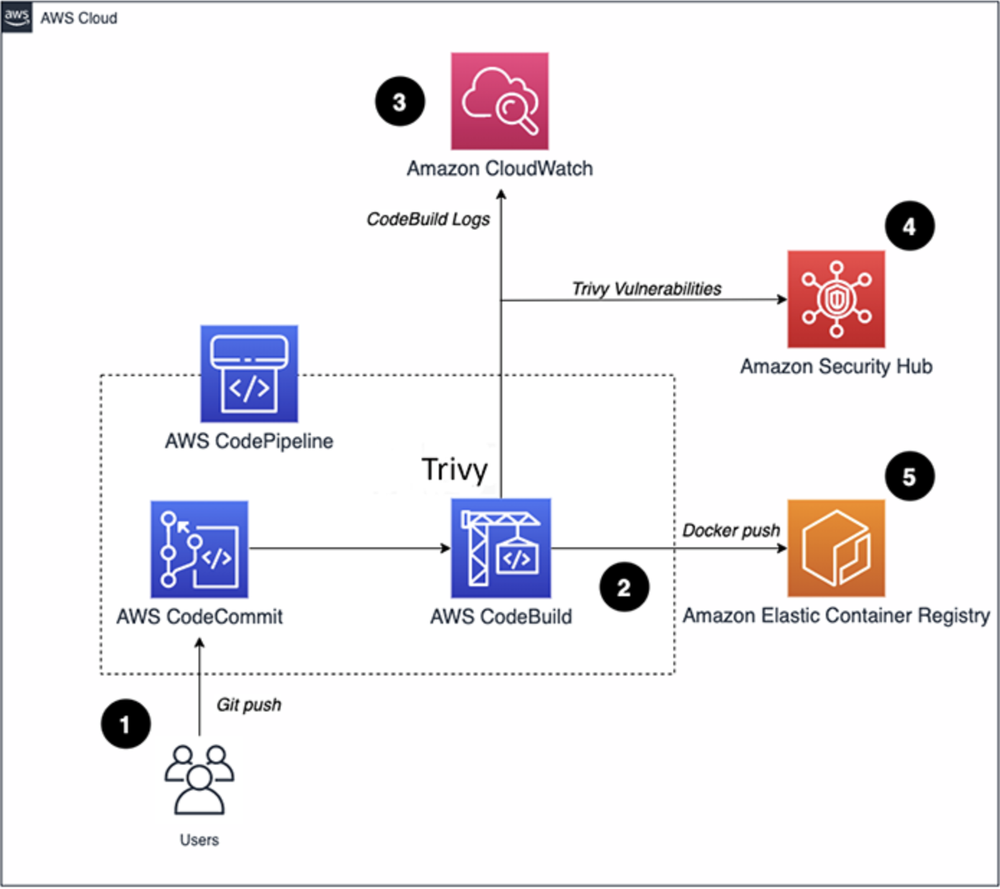
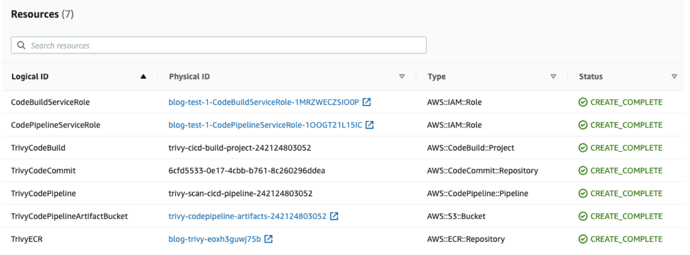
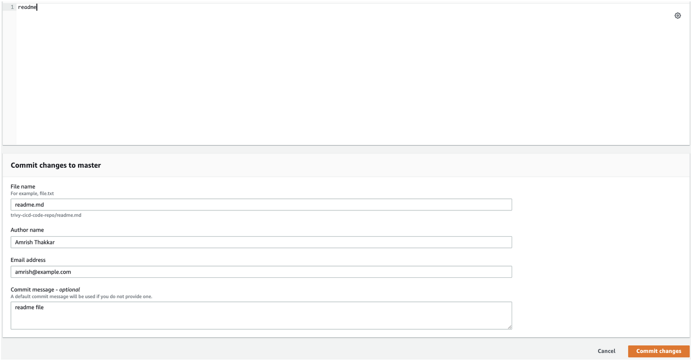
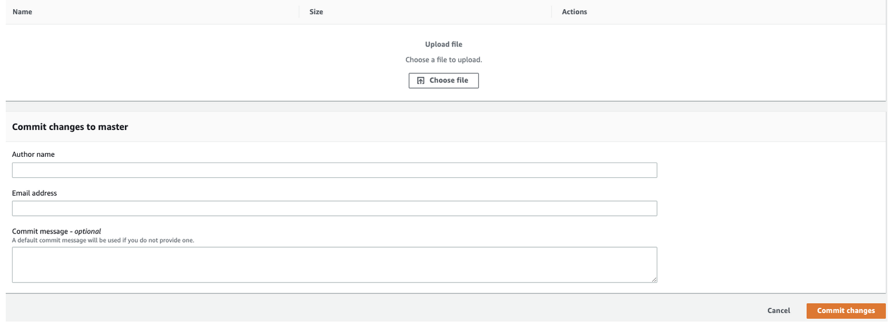
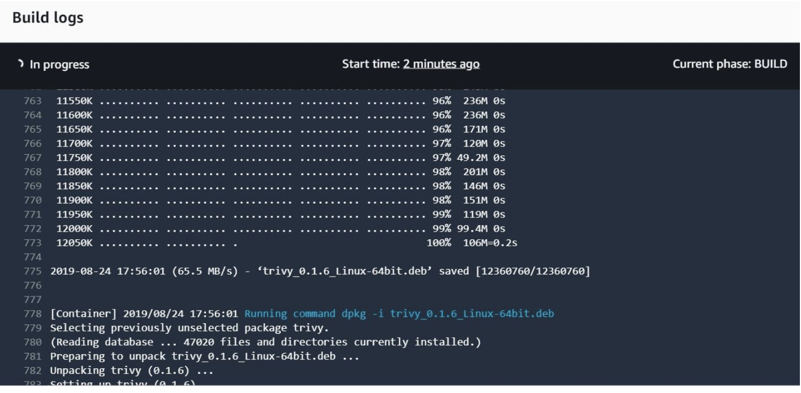
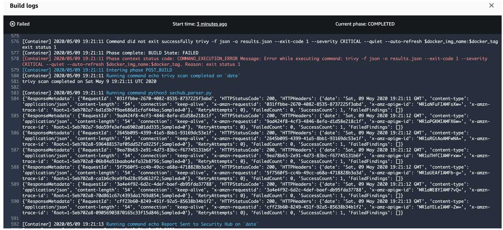
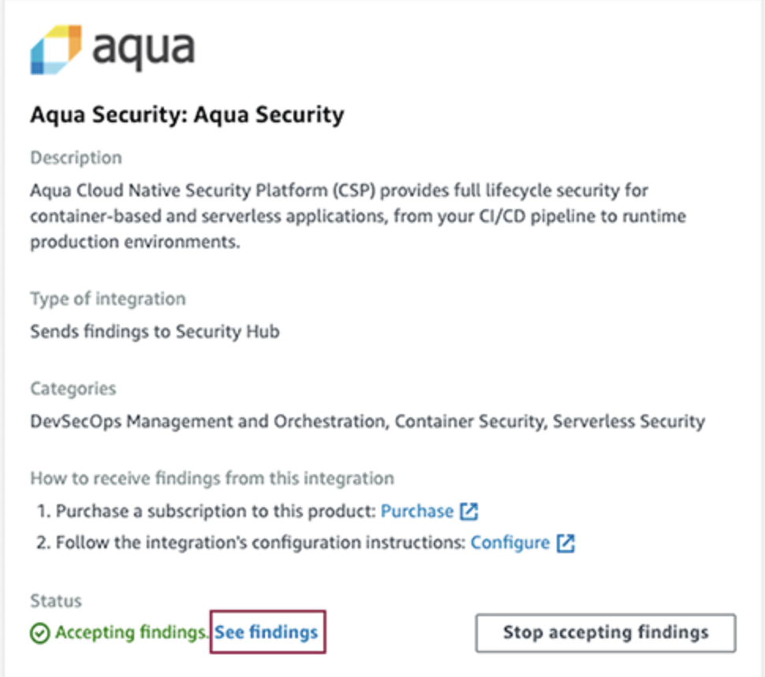
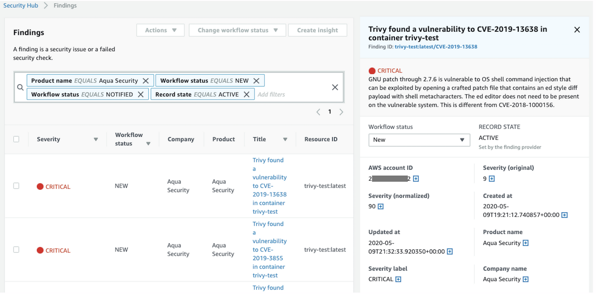
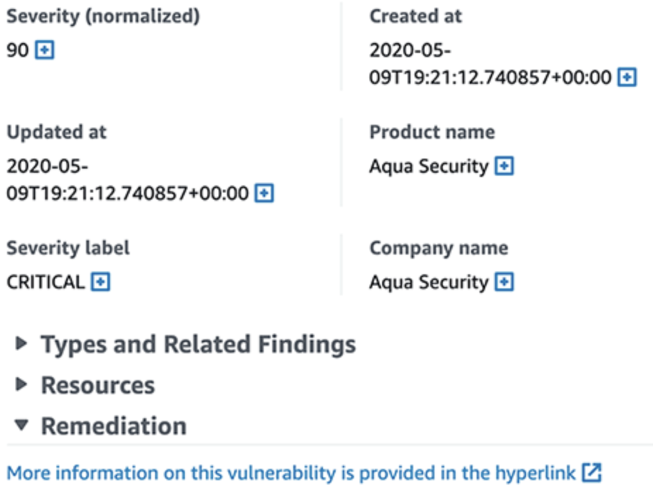
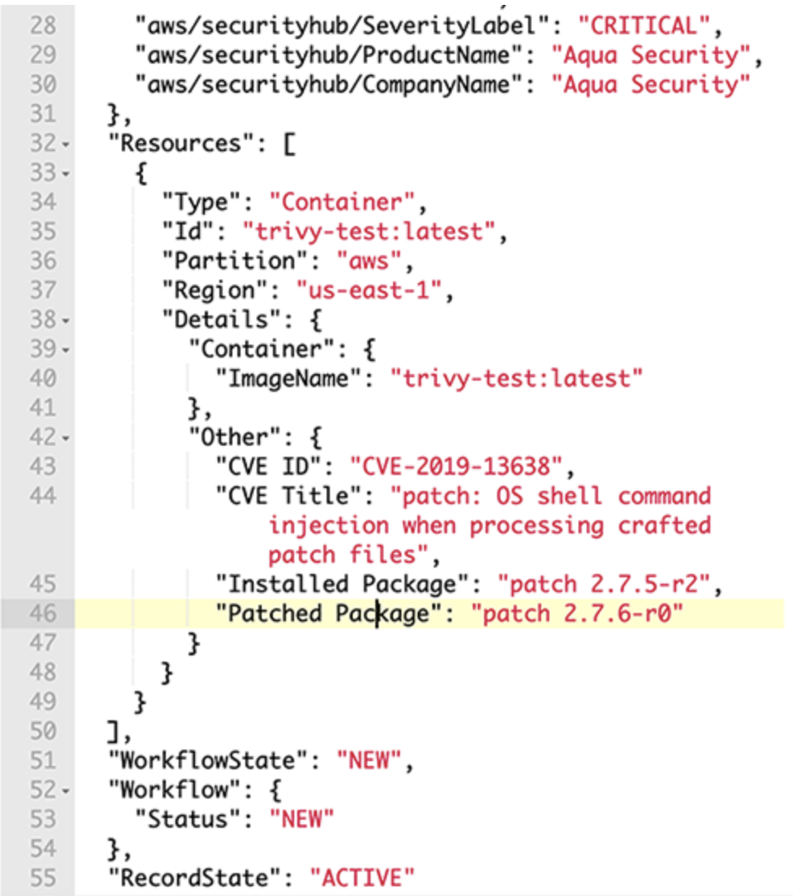

# EKS Security Workshop

[**< Voltar**](./8-Lab6.md)

# Protecting the infrastructure & Image Security

[Aqua Trivy](https://aquasecurity.github.io/trivy/v0.32/) (tri pronunciado como gatilho, vy pronunciado como inveja) é um scanner de segurança abrangente. É confiável, rápido, extremamente fácil de usar e funciona onde você precisar.

O Trivy possui diferentes scanners que procuram diferentes problemas de segurança e diferentes alvos onde podem encontrar esses problemas.

Alvos:

    Imagem do contêiner
    Sistema de arquivo
    Repositório Git (remoto)
    Cluster ou recurso do Kubernetes

Scanners:

    Pacotes de SO e dependências de software em uso (SBOM)
    Vulnerabilidades conhecidas (CVEs)
    Configurações incorretas de IaC
    Informações confidenciais e segredos


## Como instalar localmente: 

```bash
rpm -ivh https://github.com/aquasecurity/trivy/releases/download/v0.32.0/trivy_0.32.0_Linux-64bit.rpm
```

Verificar  configurações incorretas em arquivos de IaC como Terraform (para verificar a criação do cluster EKS) e Dockerfile

Comando: 
```bash
trivy config [SEU_IAC_DIR]
```

No nosso workshop podemos aplicar no diretório eks-security-workshop/terraform

```bash
trivy config eks-security-workshop/terraform
```
## Como instalar em nosso EKS Cluster

### Kubernetes Cluster Scanning - trivy operator (instalação com helm):

Primeiro, vamos adicionar o repositório Aqua Security Helm à nossa lista de repositórios Helm:

```bash
helm repo add aqua https://aquasecurity.github.io/helm-charts/
```

Em seguida, atualizaremos todos os nossos repositórios do Helm. Mesmo que você tenha acabado de adicionar um novo repositório aos gráficos existentes, geralmente é uma boa prática ter acesso às alterações mais recentes:


```bash
helm repo update
 ```

Por fim, podemos instalar o Helm Chart do operador Trivy em nosso cluster:

```bash
helm install trivy-operator aqua/trivy-operator \
   --namespace trivy-system \
   --create-namespace \
   --set="trivy.ignoreUnfixed=true" \
   --version v0.0.3
 ```

Você pode certificar-se de que o operador está instalado corretamente através do seguinte comando:

```bash
kubectl get deployment -n trivy-system 
```

O Trivy começará automaticamente a verificar seus recursos do Kubernetes. Por exemplo, você pode visualizar relatórios de vulnerabilidade com o seguinte comando:

```bash
kubectl get vulnerabilityreports --all-namespaces -o wide 
```

E então você pode acessar os detalhes do seu scan de segurança:

```bash
kubectl describe  vulnerabilityreports <name of one of the above reports> 
```

O mesmo processo pode ser aplicado para acessar o Configauditreports:

```bash
kubectl get configauditreports --all-namespaces -o wide 
```
## Scan de Images

### Como criar um pipeline de CI/CD para verificação de vulnerabilidades de contêiner com Trivy e AWS Security Hub

Nesse Lab iremos seguir os steps desse [blog post](https://aws.amazon.com/blogs/security/how-to-build-ci-cd-pipeline-container-vulnerability-scanning-trivy-and-aws-security-hub/) 

1. Objetivo

Neste Lab, vocês irão criar um pipeline de integração contínua e entrega contínua (CI/CD) usando o AWS Developer Tools, bem como o scanner de vulnerabilidade de containers de código aberto da Aqua Security, o Trivy. Você criará duas imagens do Docker, uma com vulnerabilidades e outra sem, para conhecer os recursos do Trivy e como enviar todas as informações de vulnerabilidade ao AWS Security Hub.

Muitas implantações de containers utilizam o Docker. O Docker usa Dockerfiles para definir os comandos que você usa para criar a imagem do Docker que forma a base do seu container. Em vez de aplicar o patch no local, você reescreve seu Dockerfile para apontar para imagens de base mais atualizadas, dependências ou ambas e rebuildar (reconstruir) a imagem do Docker. O Trivy permite que você saiba quais dependências na imagem do Docker são vulneráveis ​​e qual versão dessas dependências não são mais vulneráveis, permitindo que você entenda rapidamente o que corrigir para voltar a um estado seguro.

2. Arquitetura da solução:

<p align="left"> 

</p>

Veja como a solução funciona, conforme mostrado na Figura 1:

* Os desenvolvedores enviam Dockerfiles e outros códigos para o [AWS CodeCommit](https://aws.amazon.com/codecommit/features/).
* O [AWS CodePipeline](https://aws.amazon.com/codepipeline/features/?nc=sn&loc=2) inicia automaticamente uma compilação do [AWS CodeBuild](https://aws.amazon.com/codebuild/features/?nc=sn&loc=2) que usa uma [build specification](https://docs.aws.amazon.com/codebuild/latest/userguide/build-spec-ref.html) (arquivo de especificação de compilação) para instalar o Trivy, compilar uma imagem do Docker e verificá-la durante o tempo de execução.
* O AWS CodeBuild envia os logs de compilação quase em tempo real para um grupo do [Amazon CloudWatch Logs](https://docs.aws.amazon.com/AmazonCloudWatch/latest/logs/WhatIsCloudWatchLogs.html).
* O Trivy verifica todas as vulnerabilidades e as envia ao AWS Security Hub, independentemente da gravidade.
* Se nenhuma vulnerabilidade crítica for encontrada, as imagens do Docker serão consideradas como aprovadas na verificação e enviadas ao [Amazon Elastic Container Registry (ECR)](https://aws.amazon.com/ecr/), para que possam ser implantadas.

> Observação: o CodePipeline oferece suporte a diferentes fontes, como Amazon Simple Storage Service (Amazon S3) ou GitHub. Se você estiver confortável com esses serviços, sinta-se à vontade para substituí-los por este passo a passo da solução.

> Para implantar a solução rapidamente, você usará um modelo do [AWS CloudFormation]() para implantar todos os serviços necessários.

3. Pré-requisitos

* Você deve ter o Security Hub habilitado na região da AWS onde você implanta esta solução. No AWS Management Console, vá para AWS Security Hub e selecione Enable Security Hub.
*adicionar esse step aqui com print*
* Você deve ter a integração do Aqua Security habilitada no Security Hub na região onde você implanta esta solução. Para fazer isso, acesse o console do AWS Security Hub e, à esquerda, selecione Integrations, pesquise Aqua Security e selecione Accept Findings.
*adicionar esse step aqui com print*

4. Configuração

Para esta etapa, você implantará o modelo do CloudFormation e fará a configuração preliminar do repositório do CodeCommit.

* Baixe o modelo do CloudFormation do GitHub nesse [link](https://github.com/aws-samples/aws-security-hub-scan-with-trivy/blob/master/TrivyVulnScan-to-SecHub.yaml) e crie uma nova stack do CloudFormation.
* Depois que a stack do CloudFormation for concluída, acesse o console do CloudFormation e selecione a guia Resources para ver os recursos criados, conforme mostrado na figura abaixo.

<p align="left"> 

</p>

Configurando o repositório do CodeCommit:

Os repositórios do CodeCommit precisam de pelo menos um arquivo para inicializar seu branch master. Sem um arquivo, você não pode usar um repositório do CodeCommit como fonte para o CodePipeline. Para criar um arquivo de amostra, faça o seguinte.

* Vá para o console do CodeCommit e, à esquerda, selecione Repositórios e, em seguida, selecione seu repositório do CodeCommit.
* Role até a parte inferior da página, selecione a lista suspensa Adicionar arquivo e, em seguida, selecione Criar arquivo.
* Na tela Criar um arquivo, insira readme no corpo do texto, nomeie o arquivo readme.md, insira seu nome como Nome do autor e seu endereço de e-mail e selecione Confirmar alterações, conforme mostrado na abaixo.

<p align="left"> 

</p>

5. Simule uma imagem com vulnerabilidade

Para esta etapa, você adicionará ao seu repositório do CodeCommit os arquivos necessários para iniciar uma verificação automatizada de vulnerabilidades do container.

a. Verifique os arquivos na pasta lab7: 

```
cd ˜/enviroment/eks-security-workshop/lab7
``` 

*  buildspec.yml
> Observação: No código buildspec.yml, os valores prefixados com $ serão preenchidos pelas variáveis de ambiente do CodeBuild que você criou anteriormente. Além disso, o comando trivy -f json -o results.json --exit-code 1 falhará em sua compilação forçando o Trivy a retornar um código de saída 1 ao encontrar uma vulnerabilidade crítica. Você pode adicionar níveis de gravidade adicionais aqui para forçar o Trivy a falhar em suas compilações e garantir que as vulnerabilidades de gravidade mais baixa não sejam publicadas no Amazon ECR.

* sechub_parser.py: Esse script analisa os detalhes da vulnerabilidade do arquivo JSON que o Trivy gera, mapeia as informações para o [AWS Security Finding Format](https://docs.aws.amazon.com/securityhub/latest/userguide/securityhub-findings-format.html)(ASFF) e as importa para o Security Hub.

* Dockekrfile: O código clona um repositório GitHub mantido pela equipe do Trivy que possui pacotes propositadamente vulneráveis ​​que geram vulnerabilidades críticas.

b. Vá para seu repositório do CodeCommit, selecione o menu suspenso "Add file" e selecione "Upload file".

c. Na tela Upload file, selecione Choose file, selecione selecione o buildspec.yml, conclua a seção Commit changes to master adicionando o nome do autor e o endereço de e-mail e selecione Commit changes, conforme mostrado na figura abaixo:

<p align="left"> 

</p>
 
* Para fazer upload do script Dockerfile e sechub_parser.py para o CodeCommit, repita as etapas b e c para cada um desses arquivos.

* Seu pipeline será iniciado automaticamente em resposta a cada novo commit em seu repositório. Para verificar o status, volte para a exibição de status do pipeline do seu pipeline do CodePipeline.

* Quando o CodeBuild for iniciado, selecione "Details" no estágio Build do CodePipeline, em BuildAction, para ir para a seção Build no console do CodeBuild. Para ver um fluxo de logs à medida que sua compilação avança, selecione Tail logs, conforme mostrado na figura abaixo.

<p align="left"> 

</p>

* Depois que o Trivy terminar de escanear sua imagem, o CodeBuild falhará devido às vulnerabilidades críticas encontradas, conforme mostrado na Figura:
> Observação: o comando especificado no estágio de pós-compilação será executado mesmo se a compilação do CodeBuild falhar. Isso ocorre por design e permite que o script sechub_parser.py seja executado e envie descobertas para o Security Hub.

<p align="left"> 

</p>

* Agora você irá para o Security Hub para analisar melhor as descobertas e criar pesquisas salvas para uso futuro.

6. Analise seu container com vulnerabilidade no AWS Security Hub

Para esta etapa, você analisará as vulnerabilidades de seu container no Security Hub e usará a (findings view) exibição de descobertas para localizar informações no ASFF.

* Vá para o console do Security Hub e selecione  Integrations (Integrações) no painel de navegação esquerdo.

* Role para baixo até o Aqua Security integration card (cartão de integração do Aqua Security) e selecione See Findigns (Ver descobertas), conforme mostrado na Figura abaixo. Isso filtra apenas as descobertas do Aqua Security (Trivy).

<p align="left"> 

</p>

* Agora você deve ver as vulnerabilidades críticas de sua varredura anterior na visualização Descobertas, conforme mostrado na Figura abaixo. Para ver mais detalhes de uma descoberta, selecione o Título de qualquer uma das vulnerabilidades e você verá os detalhes no lado direito da tela. Visualização de descobertas.

<p align="left"> 

</p>

* Para abrir uma nova guia para um site sobre Vulnerabilidades e exposições comuns (CVE) para a descoberta, selecione o hiperlink na seção Remediação, conforme mostrado na Figura:

<p align="left"> 

</p>

* Para ver o JSON do ASFF completo, no canto superior direito da visualização Findings, selecione o hiperlink para Finding ID.

* Para encontrar informações mapeadas do Trivy, como o título do CVE e qual é a versão corrigida do pacote vulnerável, role para baixo até a seção Outros, conforme mostrado na Figura:

<p align="left"> 

</p>

* Esta foi uma breve demonstração da exploração de descobertas com o Security Hub. Você pode usar ações personalizadas para definir ações de resposta e correção, como enviar essas descobertas para um sistema de tíquetes ou agregá-las em uma ferramenta de gerenciamento de eventos de informações de segurança (SIEM).

7. Push uma imagem sem vulnerabilidade 

Agora que você viu o Trivy funcionar corretamente com uma imagem vulnerável, você corrigirá as vulnerabilidades. 
Nesse step edite o arquivo: ˜/enviroment/eks-security-workshop/lab7/Dockerfile
Cole esse trecho de código:
```
FROM alpine:3.7
RUN apk add --no-cache mysql-client
ENTRYPOINT ["mysql"]
```

Salve e faça o upload no CodeCommit, repetindo os processos anteriores.

8. Clean up:

Para limpar tudo que fizemos temos 2 passos:
* Desabilite o Security Hub
* Destrua a stack do cloudformation
* Desistale o Trivy

## Aprenda mais:

### GitOps:
Outra forma bastante eficaz de instalar e operar o Trivy é utilizando o ArgoCD (esse Addon GitOps pode ser facilmente habilita via EKS Blueprints).Segue o passo-a-passo para configuração via ArgoCD: https://aquasecurity.github.io/trivy/v0.32/tutorials/kubernetes/gitops/

[**Próximo >**](./10-Lab8.md)